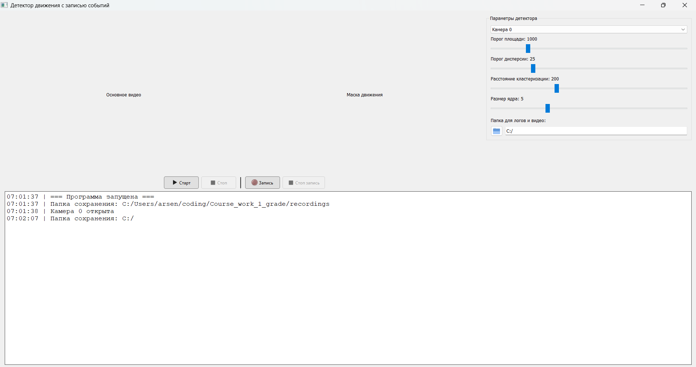

# Motion Detector with PyQt

[](https://www.python.org/)
[](https://opencv.org/)
[](https://www.riverbankcomputing.com/software/pyqt/)
[](https://opensource.org/licenses/MIT)

**Course work dedicated to implementing computer vision methods such as background subtraction and Gaussian Mixture Model (GMM) in a PyQt application.**

This application provides a real-time motion detection system with a modern GUI, featuring event-based video recording and automatic storage management.



## ✨ Features

*   **Real-time Motion Detection:** Uses OpenCV's **MOG2 background subtractor** for robust foreground segmentation.
*   **Intelligent Object Localization:** Applies morphological operations (opening/closing) and median blurring to reduce noise, followed by contour finding and **DBSCAN clustering** to merge nearby bounding boxes into one coherent object.
*   **Dual Video Display:** Shows both the original video stream with drawn bounding boxes and the processed binary motion mask.
*   **Event-Based Recording:**
    *   Automatically saves video clips when motion is detected.
    *   Includes **5 seconds before the event** (via a circular buffer) and **5 seconds after** motion stops.
    *   Saves clips to a separate `events` subfolder.
*   **Manual Recording:** A "Record" button for standard, continuous video recording.
*   **Automatic Storage Management:** The custom `ManagedVideoWriter` class monitors the total size of all `.mp4` files in the recording folder. When the user-defined limit (default 10 MB) is exceeded, the **oldest files are automatically deleted** to free up space.
*   **Interactive Control Panel:**
    *   Select from **available cameras** (scans indices 0-9 using DirectShow on Windows to avoid errors).
    *   Adjust detection parameters in real-time with sliders:
        *   `Area Threshold`: Minimum size of a detected object.
        *   `Dispersion Threshold`: Sensitivity of the MOG2 background model.
        *   `Clustering Distance`: How close two bounding boxes must be to merge.
        *   `Kernel Size`: Size of the morphological filter kernel.
*   **Integrated Log Console:** Displays all application events (start/stop, saved clips, errors) within the main window.
*   **Cross-Platform & Portable:** Developed in Python and compiled into a standalone `.exe` file for Windows, requiring no additional configuration.

## 📦 Installation

1.  **Clone the repository:**
    ```bash
    git clone https://github.com/Phoolore/Motion_detector.git
    cd Motion_detector
    ```

2.  **Set up a virtual environment (recommended):**
    ```bash
    python -m venv venv
    source venv/bin/activate  # On Windows use `venv\Scripts\activate`
    ```

3.  **Install the required dependencies:**
    ```bash
    pip install -r requirements.txt
    ```

## 🚀 Usage

1.  **Run the main application:**
    ```bash
    python detector_cleaner.py
    ```

2.  **Using the Interface:**
    *   **Select Camera:** Choose your desired camera from the dropdown menu. The app will automatically scan for available devices.
    *   **Start/Stop:** Click the **"Старт"** (Play) button to begin video capture and motion detection. Click **"Стоп"** (Stop) to halt it.
    *   **Manual Recording:** Press the **"Запись"** (Record) button to start saving a video file. An "REC" indicator will appear on the video feed. Press **"Стоп запись"** to finish.
    *   **Adjust Parameters:** Use the four sliders in the "Параметры детектора" panel to fine-tune the detection in real-time.
    *   **Choose Save Folder:** Click the folder icon to select where recordings and event clips will be stored.
    *   **Monitor the Console:** Watch the log console at the bottom for real-time feedback.

## Compilation

1.  **Use setup.py to build .exe file on Windows:**
    ```bash
    python setup.py build
    ```

1.  **Run the compiled .exe file which is inside:**
    ```bash
    build\exe.win-amd64-3.11\detector_cleaner.exe
    ```

## 🛠️ Core Classes

*   **`ManagedVideoWriter`:** A smart wrapper around `cv2.VideoWriter` that automatically manages disk space.
*   **`MotionDetector`:** Encapsulates the MOG2 background subtractor, morphological operations, and DBSCAN clustering logic.
*   **`EventRecorder` & `CircularBuffer`:** Handle the logic for recording video snippets before, during, and after motion events.
*   **`LogConsole`:** A custom logging handler that redirects log messages to a `QPlainTextEdit` widget in the GUI.
*   **`VideoDisplay`:** A `QLabel` subclass optimized for displaying OpenCV video frames.

## 🤝 Contributing

This was a course project, but suggestions and improvements are welcome! Feel free to open an issue or submit a pull request.

## 📄 License

This project is open-source and available under the [MIT License](LICENSE).